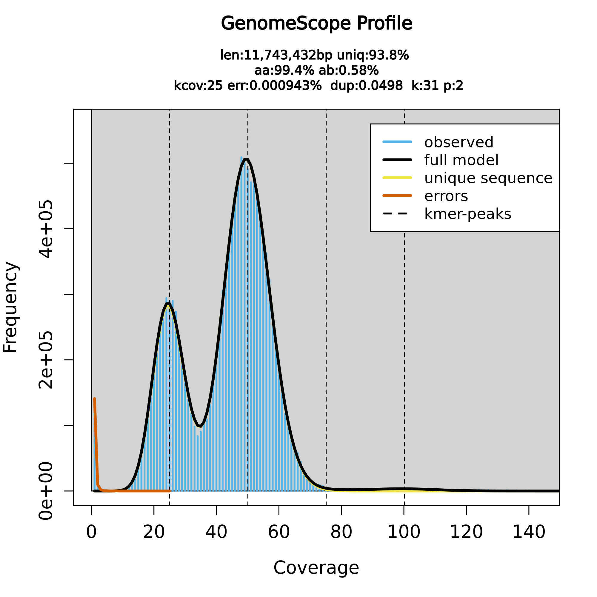
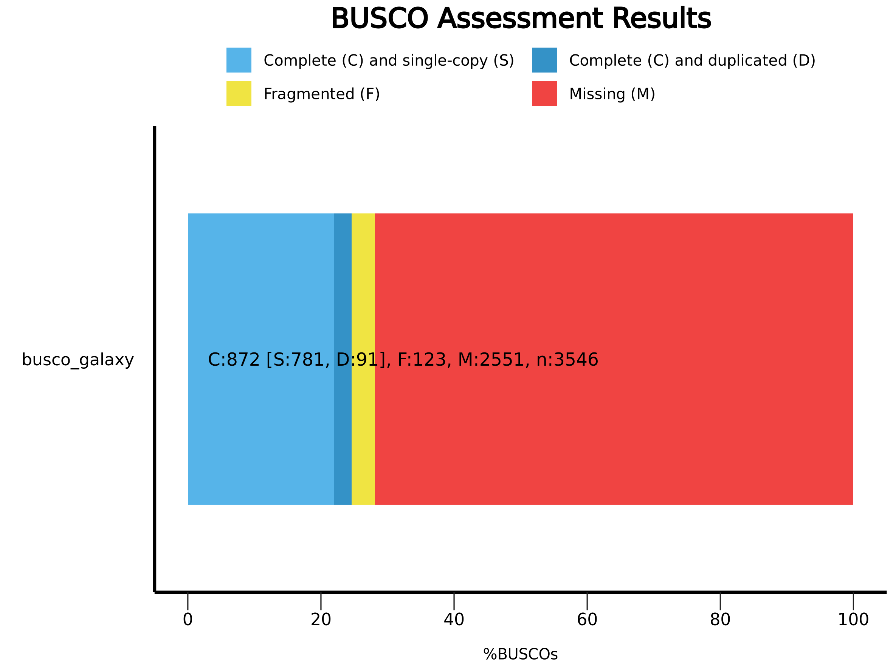

# 🧬 Genome Assembly using HiFi + Hi-C + Bionano

## 📌 Overview

This project performs vertebrate genome assembly using PacBio HiFi reads along with Hi-C and Bionano data, following the VGP (Vertebrate Genome Project) pipeline implemented in Galaxy.

The workflow includes preprocessing, genome profiling, assembly, and quality evaluation.

---

## 📂 Data Used

* HiFi reads (FASTA format)
* Hi-C reads (paired FASTQ)
* Bionano optical map data (CMAP)

---

## ⚙️ Pipeline Steps

### 1. Data Upload & Organization

* Uploaded datasets from Zenodo into Galaxy
* Organized HiFi reads into a dataset collection

---

### 2. HiFi Preprocessing

* Tool: Cutadapt
* Removed adapter sequences from HiFi reads
* Output: Trimmed HiFi reads

---

### 3. Genome Profiling

#### 🔹 K-mer Counting (Meryl)

* Generated k-mer database (k=31)
* Merged individual datasets
* Generated k-mer histogram

#### 🔹 GenomeScope Analysis

* Estimated genome characteristics:

  * Genome size
  * Heterozygosity
  * Error rate

---

### 4. Genome Assembly (hifiasm)

* Mode: Hi-C phased assembly
* Inputs:

  * HiFi reads
  * Hi-C reads
* Outputs:

  * Haplotype 1 contigs (hap1)
  * Haplotype 2 contigs (hap2)
  [Download hap1](https://drive.google.com/file/d/1LafH-RjuO-9M-ZHgLO_8rZbBRuDkGwBD/view?usp=sharing)

---

### 5. GFA to FASTA Conversion

* Tool: gfastats
* Converted assembly graphs (GFA) into FASTA format

---

### 6. Assembly Evaluation

#### 🔹 gfastats

* Generated assembly statistics:

  * Total length
  * Number of contigs
  * N50 values

#### 🔹 BUSCO

* Assessed genome completeness using conserved genes

#### 🔹 Merqury

* Evaluated assembly quality using k-mer spectra

---

### 7. Scaffolding

* Attempted Bionano hybrid scaffolding

* Due to computational limitations, this step could not be completed

* Hi-C scaffolding was initiated but not finalized due to time constraints

---

## 📊 Results

### GenomeScope Analysis

* Estimated genome size: ~11.7 Mb
* Heterozygosity: ~0.5%

### Assembly Statistics

* Hap1 and Hap2 assemblies generated successfully
* Comparable contig counts and total lengths

### BUSCO Results

* High completeness with minimal duplication

### Merqury Analysis

* Consistent k-mer distribution
* Good agreement with expected coverage

---

## ⚠️ Limitations

Due to extended runtime and queue limitations on Galaxy:

* Bionano scaffolding could not be completed
* Final Hi-C scaffolding steps were not finalized

However, the primary genome assembly and evaluation pipeline was successfully completed.

---

## ✅ Conclusion

A high-quality genome assembly was generated using HiFi reads and evaluated using multiple metrics. The results demonstrate successful reconstruction of the genome with good completeness and accuracy.

---

## 🛠 Tools Used

* Galaxy Platform
* Cutadapt
* Meryl
* GenomeScope2
* hifiasm
* gfastats
* BUSCO
* Merqury
